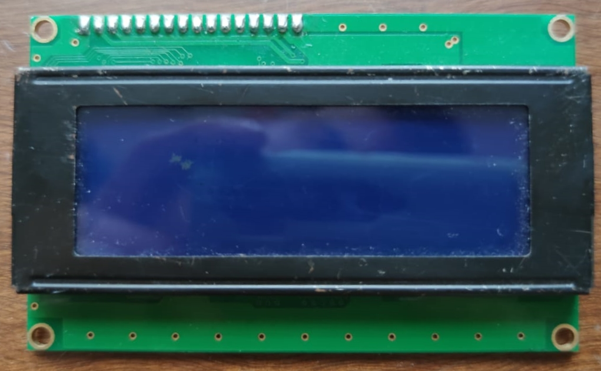

## Proyecto Sistemas Embebidos 2022-1 : Control de Acceso para Laboratorios
## Descripción
Como primer idea se plantea un sistema para acceder a un laboratoiro. Se tienen como condiciones que el acceso sea por medio del carnet universitario, donde al acercar el carnet al dispositivo que se diseñara, este desbloqueará la puerta y mostrara los datos en pantalla de la persona que desea ingresar al laboratorio. Este dispositivo activara y desactivara un electroiman que será el encargado de mantener la puerta bloqueada.

## Desarrollo y modelamiento

### Planteamiento Base del Diseño
Para lograr el objetivo del proyecto se plantean las primeras ideas en cuanto a diseño del dispositivo, se plantean las primeras ideas basicas en forma grafica con el fin de ordenar y establecer como  distribuir las tareas que corresponde a Hardware y Software. Esta ideacion esta sujeta a cambios o ajuste debido a las limitaciones del mismo.

### Diagrama de Flujo

### Particionamiento Hardware y Software
#### HardWare
Para esta sección se establecen los siguientes periféricos:  
##### LCD 20x4
EL fin de este periferico es ver la información de la tarjeta con la que se desea ingresar, de igual manera ver si la solicitude de acceso al laboratoirio se aprueba o se denega.

  

##### PCF8574 Interfaz expansora I^2C
Este modulo se estableció con el fin de generar una comunicación y así verificar los datos obtenidos por medio de la tarjeta entre el sistema implementado y un dispositivo externo.

  

##### RFID RC522

Este modulo se implementa con el fin de leer los datos aportados por la tarjeta

  

##### Rele 5V Forma C

Este modulo se implementa para aislar la señal digital que nos da o nos niega el acceso de la puerta

  

##### Modulo ESP32 WROOM

Como último se tiene la tarjeta ESP32 desde donde se controlan los demás modulos, se implementa el codigo referente al proyecto

  

##### Fuente de Alimentacion

Se plantean 2 soluciones para la alimentación del sistema, como primer solución se tiene una fuente variable que corresponde al de la siguiente imagen.

###### Fuente 12 V

  

###### Bateria 12 V

Como segunda solución se plantea la implementación de una bateria extraida de una motocicleta, la cual se puede ver en la siguiente imagen

  

#### SoftWare
##### Codigo

#include <SPI.h>
#include <MFRC522.h>
// start of settings for LCD1602 with I2C
#include <LiquidCrystal_I2C.h>
// Set the LCD address to 0x27 for a 16 chars and 2 line display
LiquidCrystal_I2C lcd(0x27, 16, 4);
// watch video for details of 0x3F I2C address
// end of settings for LCD1602 with I2C
 #include<TimeLib.h> 
#define SS_PIN 25
#define RST_PIN 26
MFRC522 mfrc522(SS_PIN, RST_PIN);   // Create MFRC522 instance.
#include "BluetoothSerial.h"

#if !defined(CONFIG_BT_ENABLED) || !defined(CONFIG_BLUEDROID_ENABLED)
#error Bluetooth is not enabled! Please run `make menuconfig` to and enable it
#endif
int boton = 5;
int led1 = 2;
int led2 = 4;
BluetoothSerial SerialBT;
 
void setup() 
{
  Serial.begin(9600);   // Initiate a serial communication
  SerialBT.begin("ESP32");
  Serial.println("The device started, now you can pair it with bluetooth!");
  SPI.begin();      // Initiate  SPI bus
  mfrc522.PCD_Init();   // Initiate MFRC522
  lcd.init();  
  lcd.backlight();
  lcd.print("   LAB GEO-TECNIA  ");
  lcd.setCursor(0,1);
  lcd.print("ACERQUE SU TARJETA");  
  delay(2000); 
   pinMode(led1, OUTPUT);
  pinMode(led2, OUTPUT);
  pinMode(boton, OUTPUT);
  digitalWrite(led1, LOW);
  digitalWrite(led2, LOW);
    digitalWrite(boton, HIGH);
  
     
  Serial.println("Acerque su tarjeta");
  Serial.println();
    setTime(7,50,0,5,7,2022);

    
     

}
void loop() 

      {
   
  

  // Look for new cards
  if ( ! mfrc522.PICC_IsNewCardPresent()) 
  {
    return;
  }
  // Select one of the cards
  if ( ! mfrc522.PICC_ReadCardSerial()) 
  {
    return;
  }
  //Show UID on serial monitor
  Serial.print("UID tag :");
   SerialBT.print("UID tag :");
  String content= "";
  byte letter;
  for (byte i = 0; i < mfrc522.uid.size; i++) 
  {
     Serial.print(mfrc522.uid.uidByte[i] < 0x10 ? " 0" : " ");
     Serial.print(mfrc522.uid.uidByte[i], HEX);
      SerialBT.print(mfrc522.uid.uidByte[i] < 0x10 ? " 0" : " ");
     SerialBT.print(mfrc522.uid.uidByte[i], HEX);
     content.concat(String(mfrc522.uid.uidByte[i] < 0x10 ? " 0" : " "));
     content.concat(String(mfrc522.uid.uidByte[i], HEX));
  }
  Serial.println();
  Serial.print("Message : ");
  content.toUpperCase();
  if (content.substring(1) == "3E F4 72 51" || content.substring(1) == "08 B6 A9 43"  ) //change here the UID of the card/cards that you want to give access
  {
      
    Serial.println("Acceso autorizado");
     SerialBT.print(' ');
     SerialBT.println("Acceso autorizado");
         SerialBT.println();
 SerialBT.print("Fecha: ");
      SerialBT.print('\n');
 SerialBT.print (day(), DEC);
   SerialBT.print('/');
  SerialBT.print (month(), DEC);
    SerialBT.print('/');
   SerialBT.print(year(), DEC);
       SerialBT.print('\n');
     SerialBT.print("Hora: ");
      SerialBT.print('\n');
     SerialBT.print(hour(), DEC);
   SerialBT.print(':');
  SerialBT.print (minute(), DEC);
      SerialBT.print('\n');
      lcd.clear();
         lcd.setCursor(0,1);
  lcd.print("ACCESO AUTORIZADO");  
    Serial.println();
    digitalWrite(led2, HIGH);
    digitalWrite(led1, LOW);
    delay(3000);
           lcd.print("   LAB GEO-TECNIA  ");
     lcd.setCursor(0,1);
  lcd.print("ACERQUE SU TARJETA");
    digitalWrite(led2, LOW);
  }
 
 else   {
    Serial.println(" Acceso no autorizado");
    SerialBT.print(' ');
    SerialBT.println("Acceso no autorizado");
        SerialBT.println();
         SerialBT.print("Fecha: ");
      SerialBT.print('\n');
 SerialBT.print (day(), DEC);
   SerialBT.print('/');
  SerialBT.print (month(), DEC);
    SerialBT.print('/');
   SerialBT.print(year(), DEC);
       SerialBT.print('\n');
     SerialBT.print("Hora: ");
      SerialBT.print('\n');
     SerialBT.print(hour(), DEC);
   SerialBT.print(':');
  SerialBT.print (minute(), DEC);
      SerialBT.print('\n');;
        digitalWrite(led2, LOW);
        digitalWrite(led1, HIGH);
        lcd.clear();
           lcd.print("   LAB GEO-TECNIA  ");
              lcd.setCursor(0,1);
              
  lcd.print("ACCESO NO AUTORIZADO");
    delay(3000);
     lcd.setCursor(0,1);
  lcd.print("ACERQUE SU TARJETA");
    digitalWrite(led1, LOW);
  }
}
### Esquema del Diseño

Este se divide en 4 "Islas" principales, divididos segun los valores de alimentacion. 

En primera instancia se se tienen los componetes que operan a con 3.3 V

### Diseño del Circuito Impreso
### Error de Diseño
### Proceso de Compra
### PCB impresa

## Pruebas
Las pruebas se realizaron sobre 2 tajetas. En primer lugar se trabajo con una tarjeta  experimental, que consiste en una baquelita solda donde se probaron los perifericos mediantes una tarjeta de desarrollo ESP32 DEVKIT V1. Una vez comprobado el funcionamiento de los perifericos y el codigo en la tarjeta experimental, se procede a aplicarlo en la PCB diseñada y realizar los cambios pertinentes para lograr las tares que se requieren.
### Experimental

  

  

### Diseñada

  

  

## Funcionamiento
## Resultados
### Prototipo

