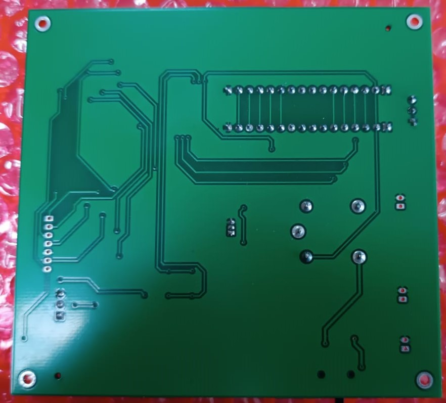

## Proyecto Sistemas Embebidos 2022-1 : Control de Acceso para Laboratorios
## Descripción
Como primer idea se plantea un sistema para acceder a un laboratoiro. Se tienen como condiciones que el acceso sea por medio del carnet universitario, donde al acercar el carnet al dispositivo que se diseñara, este desbloqueará la puerta y mostrara los datos en pantalla de la persona que desea ingresar al laboratorio. Este dispositivo activara y desactivara un electroiman que será el encargado de mantener la puerta bloqueada.

## Desarrollo y modelamiento

### Planteamiento Base del Diseño
Para lograr el objetivo del proyecto se plantean las primeras ideas en cuanto a diseño del dispositivo, se plantean las primeras ideas basicas en forma grafica con el fin de ordenar y establecer como  distribuir las tareas que corresponde a Hardware y Software. Esta ideacion esta sujeta a cambios o ajuste debido a las limitaciones del mismo.

### Diagrama de Flujo

### Particionamiento Hardware y Software
#### HardWare
Para esta sección se establecen los siguientes periféricos:  
##### LCD 20x4

  

##### PCF8574 Interfaz expansora I^2C

  

##### RFID RC522

  

##### Rele 5V Forma C

  

##### Modulo ESP32 WROOM

  

##### Fuente de Alimentacion
###### Fuente 12 V

  

###### Bateria 12 V

  

#### SoftWare
##### Codigo
### Esquema del Diseño

Este se divide en 4 "Islas" principales, divididos segun los valores de alimentacion. 

En primera instancia se se tienen los componetes que operan a con 3.3 V

### Diseño del Circuito Impreso
### Error de Diseño
### Proceso de Compra
### PCB impresa

## Pruebas
Las pruebas se realizaron sobre 2 tajetas. En primer lugar se trabajo con una tarjeta  experimental, que consiste en una baquelita solda donde se probaron los perifericos mediantes una tarjeta de desarrollo ESP32 DEVKIT V1. Una vez comprobado el funcionamiento de los perifericos y el codigo en la tarjeta experimental, se procede a aplicarlo en la PCB diseñada y realizar los cambios pertinentes para lograr las tares que se requieren.
### Experimental

  

  

### Diseñada

  

  

## Resultados
### Prototipo

